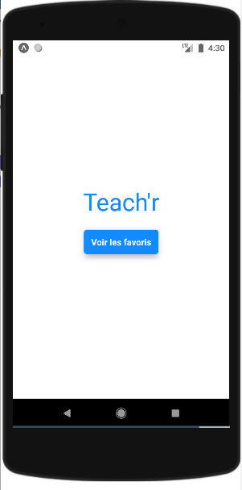

# Teach'r API 

Test technique demandé par Teach'r.

L'objectif du projet est de créer une API qui offre 3 routes pour manager
une ressource ***"Teachr"***. Et une application mobile pour afficher cette ressource.

Vous pouvez retrouver le backend dans le dossier `back` et le frontend, dans le dossier `front`. avec les instructions de 
lancement de chacun.

 &nbsp;&nbsp;&nbsp;&nbsp;

